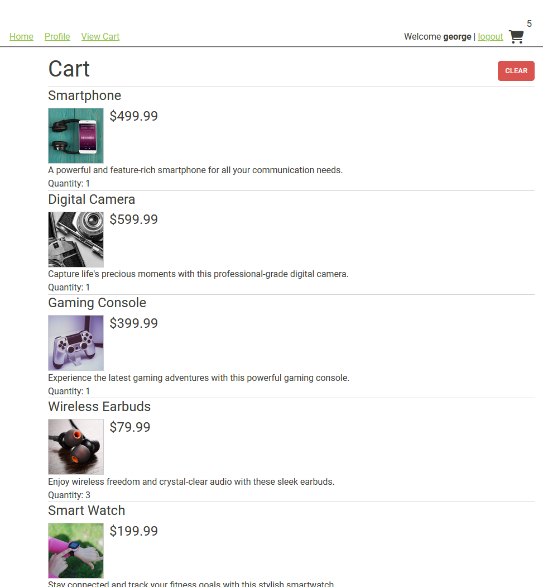
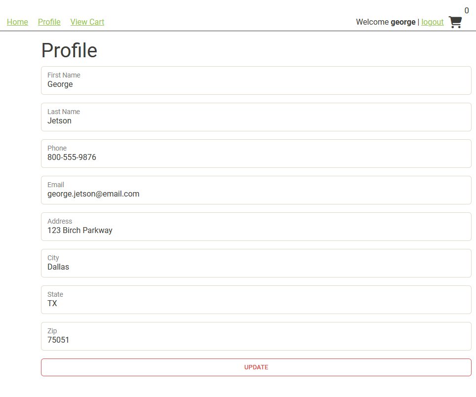

# EasyShop API

EasyShop is an online store that allows users to log in/out, edit their profiles, browse and filter through the various
products available on the platform, and add those items to their cart (should they change their mind, they can also
clear their cart). I made it through phase 4 of this project, here is an overview of recent updates:

## Phase One: Categories Controller

- New feature: Added the ability to filter products by category
  - Standard users are only able to filter, while administrators are able to **create, update**, or **delete**
    categories
  - Currently, there is no way to modify categories on the frontend. These actions must be done on Postman, or similar
    platform

## Phase Two: Bug Fixes

- Fixed a bug related to filtering by price range
- Fixed a bug related to duplicate products on update actions done by administrators

## Phase Three: Shopping Cart!!

- New feature: Added the ability to add items to shopping carts (**YES, finally!!**), as well as clearing carts
  - Additionally, you can add multiples of the same item to your cart!

Full cart:

After clearing cart:

## Phase Four: User Profile

- New feature: users can now edit their profile details (name, phone number, address, etc...)

Before:

After:

## Honorable Mention

During this project I learned that I can call protected methods from a different class, but within the same package

